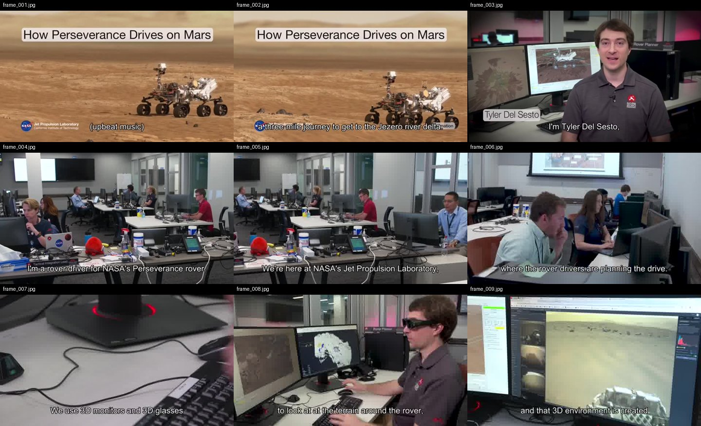

# claude-real-video (timeline fork)

[](https://www.python.org/) [](LICENSE)

**Let Claude — or any LLM — actually watch a video.**

> **This is a fork of [HUANGCHIHHUNGLeo/claude-real-video](https://github.com/HUANGCHIHHUNGLeo/claude-real-video) by LeoAido (MIT).**
> The upstream tool extracted scene-aware frames and a transcript, but the two lists shared no time axis: frames were named `frame_001.jpg…` (sequence only) and the transcript had its timecodes stripped — so an LLM couldn't tell *which words were spoken at which visual change*. Upstream's own skill file already promised "every frame with timestamps"; this fork actually delivers it. See [**What this fork adds**](#what-this-fork-adds-060) below.


> Same 58-second clip: fixed 1 fps sampling = **58 frames**. crv keeps the **26 that actually differ** — and `--grid` packs them into **3 contact sheets**. Fewer tokens, nothing missed.

Most AI tools don't really *see* a video. Paste a YouTube link into ChatGPT and it
reads the **transcript**, not the picture. Claude won't take a video file at all.
Even Gemini, which *can* read video natively, has to send it up to Google and
samples frames at a **fixed interval** (1 fps by default), so fast cuts slip past.

`claude-real-video` does it differently, and **locally**: point it at a URL or a
file, and it pulls the frames that *actually matter* (every scene change, not a
fixed quota), throws away the near-duplicates, transcribes the audio, and hands
you a clean folder any LLM can read. All the processing happens on your own machine — what gets sent anywhere is only the frames/text *you* choose to paste into an LLM afterwards.

```bash
crv "https://www.youtube.com/watch?v=..."
# → crv-out/frames/*.jpg  +  crv-out/transcript.txt  +  crv-out/MANIFEST.txt
```

Then drop the frames + `MANIFEST.txt` into Claude / ChatGPT / Gemini and ask away.

## What this fork adds (0.6.0)

The upstream tool gave the model an ordered pile of frames and a separate wall of
text with no shared clock. This fork puts **frames and speech on one time axis** so
"what was said when this changed" is answerable:

- **Real per-frame timestamps** — the extractor reads each kept frame's actual
  position from ffmpeg's `showinfo` (`pts_time`), instead of relying on filename
  order. Frames still sort chronologically, but now every one knows *when* it is.
- **Timestamped transcript** — subtitle/Whisper timecodes are **kept**, not
  discarded. `transcript.txt` becomes `[MM:SS] line` (Whisper is asked for `.srt`,
  not `.txt`).
- **A unified timeline in `MANIFEST.txt`** — every kept frame and every spoken cue
  merged and sorted by timestamp, so a visual change sits right next to the words
  around it:

  ```
  --- timeline (video changes <-> speech, by timestamp) ---
  [00:00] frame  frame_001.jpg
  [00:00] speech Red scene: the introduction begins here.
  [00:03] speech Green scene: now we move to the second topic.
  [00:03] frame  frame_002.jpg
  ```

- **Timestamps on `--grid` cells and `--report` captions** too, so the model can
  cite a moment straight off the contact sheet.

Everything else (scene-aware selection, sliding-window dedup, `--why`, `--kb`,
`--keep-audio`) is unchanged from upstream. Fully backward compatible — same CLI,
same output files, just now time-aligned.

Not doing LLM work? It also works as a **general-purpose video keyframe extractor** —
scene-change detection + dedup, no ML models to download.

**Using Claude Code?** Install it as a skill so Claude watches videos on its own:

```bash
pip install "git+https://github.com/nullponull/claude-real-video"
mkdir -p ~/.claude/skills && cp -r skills/claude-real-video ~/.claude/skills/
```

Then just paste a video link into Claude Code and ask about it.

**New in 0.3.0** — tell it *why* you're watching, and keep what it finds:

```bash
crv "https://youtu.be/..." --why "find the pricing strategy" --kb ~/notes
```

`--why` makes the analysis focus on what you care about instead of a generic summary;
`--kb` saves the result as a dated note in your own notes folder, so it doesn't die in `crv-out`.

---

## Why not just sample frames?

Most "let an LLM watch a video" scripts (and Gemini's own pipeline) grab frames
at a **fixed interval** — e.g. one per second. That over-samples a static
screencast and under-samples a fast-cut reel. `claude-real-video` is smarter:

| | fixed-interval sampling | **claude-real-video** |
|---|---|---|
| Frame selection | every N seconds | **scene-change detection** + density floor |
| Repeated shots (A-B-A cuts) | sent again every time | **sliding-window dedup** sends each shot once |
| Static slide (10 min) | ~600 near-identical frames | **collapses to 1** (dedup) |
| Fast-cut reel | misses frames between samples | catches each visual change |
| Audio | often ignored | Whisper transcript w/ language detect |
| Where the processing happens | often in someone's cloud | **on your machine** (you choose what to share with an LLM afterwards) |
| Input | usually local file only | **URL (yt-dlp) or local file** |

You feed the model *fewer, more meaningful* frames — cheaper context, better
understanding.

---

## Install

```bash
# this fork (adds the timestamped timeline) — install straight from GitHub:
pip install "git+https://github.com/nullponull/claude-real-video"                # core (frames + dedup)
pip install "claude-real-video[whisper] @ git+https://github.com/nullponull/claude-real-video"  # + audio transcription
```

> The name on PyPI (`pip install claude-real-video`) is **upstream**, which does
> **not** have the timeline changes — install from this repo to get them.

### System requirement: ffmpeg

`ffmpeg` / `ffprobe` are used for frame extraction and audio, and aren't
pip-installable. Install them once:

| OS | command |
|---|---|
| **macOS** | `brew install ffmpeg` |
| **Linux** | `sudo apt install ffmpeg` (or your distro's package manager) |
| **Windows** | `winget install Gyan.FFmpeg` — or `choco install ffmpeg` — or [download a build](https://www.gyan.dev/ffmpeg/builds/) and add its `bin\` folder to your `PATH` |

Verify it's on your `PATH`:

```bash
ffmpeg -version
```

Transcription uses the `whisper` CLI (installed by the `[whisper]` extra, or
`pip install openai-whisper`). Whisper also relies on ffmpeg.

Works on **macOS, Windows, and Linux** — Python 3.10+.

---

## Usage

```bash
# A YouTube / Instagram / TikTok / ... link
crv "https://www.instagram.com/reel/XXXX/"

# A local file, English transcript, output to ./out
crv lecture.mp4 -o out --lang en

# Frames only, no transcription
crv clip.mp4 --no-transcribe

# A login-gated video (your own / authorised use): pass a Netscape cookie file
crv "https://..." --cookies cookies.txt
```

`python -m claude_real_video ...` works as an alias for `crv` too.

### Options

| flag | default | meaning |
|---|---|---|
| `-o, --out` | `crv-out` | output directory |
| `--scene` | `0.30` | scene-change sensitivity (lower = more frames) |
| `--fps-floor` | `1.0` | at least one frame every N seconds |
| `--max-frames` | `150` | hard cap on total frames |
| `--lang` | `auto` | Whisper language (`en`, `zh`, `auto`, ...) |
| `--dedup-threshold` | `8` | % of pixels that must change for a frame to count as new; higher = fewer frames |
| `--dedup-window` | `4` | compare against the last N kept frames — a shot the model already saw doesn't come back after a cutaway (`1` = consecutive-only) |
| `--report` | off | keep dropped frames in `./dropped` + write `report.html` visualising every keep/drop decision |
| `--no-transcribe` | off | skip audio |
| `--keep-audio` | off | also save the **full soundtrack** (`audio.m4a`) so audio models can *hear* it |
| `--why` | – | why you're watching, e.g. `--why "find the pricing strategy"` — written into `MANIFEST.txt` so the model analyses with that lens instead of a generic summary |
| `--kb` | – | also save the analysis as a dated markdown note into this folder (your Obsidian vault, notes dir, ...) — so it joins your knowledge base instead of dying in `crv-out` |
| `--cookies` | – | Netscape cookie file for login-gated sources |

---

### What `--grid` output looks like

One contact sheet = nine consecutive keyframes, in order, filenames on each cell — the model reads a sequence, not scattered stills:



## Use it from Python

```python
from claude_real_video import process

r = process("https://youtu.be/...", "out", lang="en")
print(r.frame_count, r.transcript_path)
```

---

## How it works

1. **Fetch** — `yt-dlp` for URLs (optional cookies), or copy a local file.
2. **Extract** — one chronological `ffmpeg select` pass grabs every scene change
   *plus* a density floor (at least one frame every `--fps-floor` seconds), so
   fast cuts and slow screencasts are both covered.
3. **Dedup** — real pixel difference (downscaled RGB, not a perceptual hash — hashes
   go blind on flat colours and equal-luma hue changes) against a **sliding window**
   of the last `--dedup-window` kept frames, so an A-B-A cutaway doesn't re-send a
   shot the model has already seen. `--report` writes `report.html` showing every
   keep/drop decision with its diff %, for tuning.
4. **Text** — if the video **already has subtitles** (a sidecar `.srt`/`.vtt` next to a
   local file, or an embedded subtitle track), those are used as the transcript —
   faster and more accurate than re-transcribing. Only when there are no subtitles
   does it fall back to **Whisper** on the audio (skipped cleanly if there's no audio).
   Either way the **start timecodes are kept** (`transcript.txt` is `[MM:SS] line`),
   so the words can be placed on the timeline.
5. **Audio** *(optional, `--keep-audio`)* — save the **full original soundtrack**
   (`audio.m4a`: music + speech + effects, copied losslessly when possible). The
   transcript only has the *words*; the audio file lets a model that can listen
   (Gemini, GPT-4o, …) actually *hear* the music and tone.
6. **Manifest** — `MANIFEST.txt` summarises everything for the model, including a
   **unified timeline** that merges the kept frames and the spoken cues on one
   timestamp axis (this fork), so each visual change sits next to the words around it.

So the model can **see** (key frames), **read** (transcript) and — with `--keep-audio` —
**hear** (full soundtrack) the video. The transcript is plain text any model can read;
the tool **doesn't burn subtitles into the video** — burning is a presentation choice,
not something needed to make a video AI-readable.

---

## Notes

- Only download content you have the right to. The `--cookies` option is for
  your own, authorised access — don't ship credentials in a repo.
- Re-running overwrites the output directory.

## Credits

- Original **claude-real-video** by **LeoAido** — <https://github.com/HUANGCHIHHUNGLeo/claude-real-video>.
  All of the scene-aware extraction, dedup, and manifest design is theirs; the
  upstream author also sells a **crv Pro** with richer analysis (camera moves,
  editing rhythm, a perception timeline of gestures/emotion/sound) — see the
  upstream repo / <https://leoaido.com/crv-pro/>.
- This fork adds the **frames↔speech timestamped timeline** described above and is
  maintained by **nullponull**.

## License

MIT — see [LICENSE](LICENSE). Copyright (c) 2026 LeoAido; fork modifications
(c) 2026 nullponull. The original copyright notice is retained as required.
